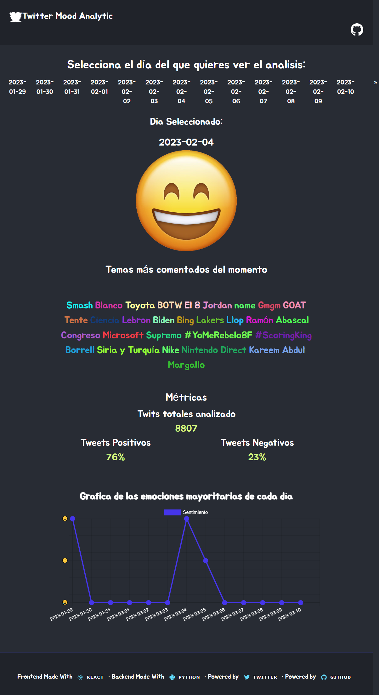
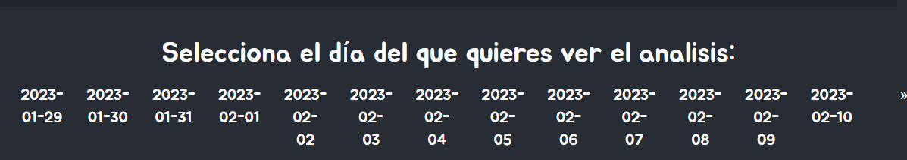
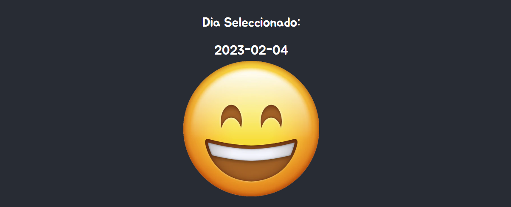
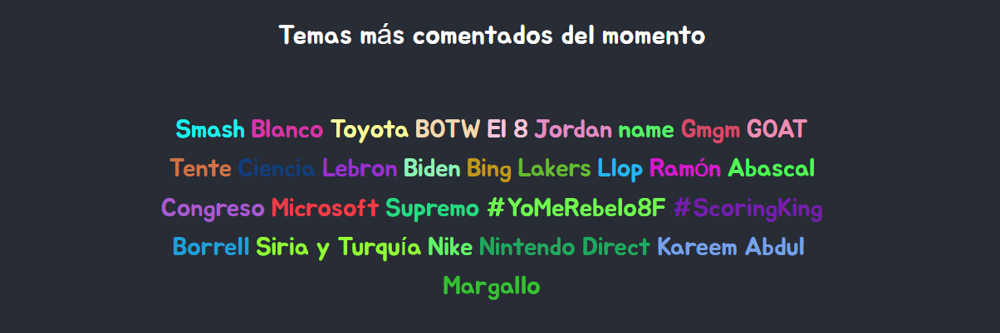
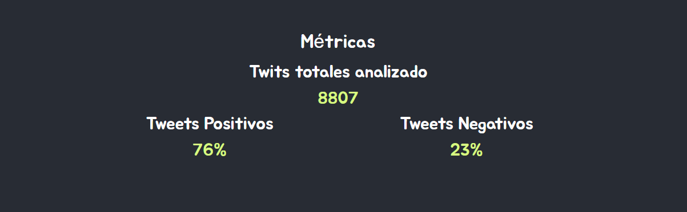
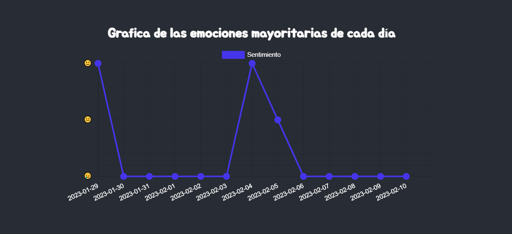

<!-- Improved compatibility of back to top link: See: https://github.com/othneildrew/Best-README-Template/pull/73 -->

<!--
*** Thanks for checking out the Best-README-Template. If you have a suggestion
*** that would make this better, please fork the repo and create a pull request
*** or simply open an issue with the tag "enhancement".
*** Don't forget to give the project a star!
*** Thanks again! Now go create something AMAZING! :D
-->

<!-- PROJECT SHIELDS -->
<!--
*** I'm using markdown "reference style" links for readability.
*** Reference links are enclosed in brackets [ ] instead of parentheses ( ).
*** See the bottom of this document for the declaration of the reference variables
*** for contributors-url, forks-url, etc. This is an optional, concise syntax you may use.
*** https://www.markdownguide.org/basic-syntax/#reference-style-links
-->

<!-- PROJECT LOGO -->
 

  

<h3 align="center">Twitter Mood Analytic · Frontend</h3>

  

    Frontend de Twitter Mood Analytic
     
    <a href="https://github.com/crakernano/twitter_mood_analytic/wiki"><strong>Consulta la documentación »</strong></a>
     
     
    <a href="http://www.crakernano.com/twitter_mood_analytic/">Visita la web</a>
    ·
    <a href="https://github.com/crakernano/twitter_mood_analytic/issues">Reporta Bugs</a>
    ·
    <a href="https://github.com/crakernano/twitter_mood_analytic/issues">Propon nuevas funcionalidades</a>
   
  

***

[![Contributors][contributors-shield]][contributors-url]
[![Forks][forks-shield]][forks-url]
[![Stargazers][stars-shield]][stars-url]
[![Issues][issues-shield]][issues-url]
[![MIT License][license-shield]][license-url]
[![LinkedIn][linkedin-shield]][linkedin-url]

## Creado con

[![Python][Python]][Python]
![React.js][React.js]

<!-- ABOUT THE PROJECT -->
## El Proyecto

Twitter Mood Analytic utiliza la API de Twitter para obtener los temas más relevantes del momento, los analiza mediante NLP ( Natural Language Processing, una rama de la inteligencia artificial orientada al entendimiento y uso del lenguaje humano ) y determina si transmiten una emoción positiva o negativa, de forma de que al totalizar cada uno de ellos podemos "tomar la temperatura" del estado animico de los usuarios en una determinada ciudad y momento.

Si deseas conocer más sobre la implementación del NLP en este proyecto te recomiendo que [visites el respositorio en el que se encuentra](https://github.com/crakernano/twitter_mood_analytic/tree/main) alojado o consultes [la documentación](https://github.com/crakernano/twitter_mood_analytic/wiki)

Una vez obtenidos estos datos, se exportan en ficheros (como parte del reto del proyecto se decidió no emplear bases de datos, APIs ni ningún otro elemento externo) que son leidos 
desde la aplicación REACT que visualiza la información. 

### Tipos de visualizaciones

Dentro de la web de Twitter Mood Analytic podemos ver distintos tipos de representaciones de datos, cada una de ellas muestra una parte del analisis realizado de los twitts. Para poder visualizar el analisis de un día, primero tenemos que seleccionarlo en el selector. 

En cuanto le demos, la información se carga automaticamente permitiendo ver de forma sencilla las conclusiones que la IA ha sacado del analisis realizado, para empezar la impresión sobre el estado anemico general se muestra usando un _emoji_ :

El cual varia en función del sentimiento extraido de todos los twits analizados ese día, puede ser sonriente si la mayoría de los mensajes mostraban actitudes positivas, lloroso si las impresiones eran negativas o neutras si el balance estaba equilibrado. 

A continuación podemos ver una nube de tags en la que se visualizan los temás más comentados del momento (Los _trending topic_ o _TT_ en jerga de Twitter). De cada una de estas etiquetas se han extraido los 100 mensajes más relebantes y con ellos se ha realizado el analisis. 

Posteriormente podemos ver las métricas númericas extraidas del analisis. Primero vemos el total de twits analizados, y por debajo el porcentaje de ellos que eran positivos y negativos según el criterio seguido por el algoritmo de NLP con el que se ha realizado el analisis. 

Finalmente una gráfica muestra el desarrollo del estado de animo día a día. 

(<a href="#readme-top">back to top</a>)

<!-- ROADMAP -->
## Roadmap

- [X] Extracción de datos usando la API de Twitter
    - [X] Obtención de TT
    - [X] Obtención de los mensajes más relevantes para cada TT
- [X] Analísis de sentimiento de cada Tweet extraido
- [X] Tokenización de los tweet
- [X] Limpiado de datos, obtención de tags partiendo de los mensajes
- [X] Exportación de los datos analizados en ficheros CSV
- [X] Explotación de los datos
    - [X] Opción de elegir el día de entre los datos disponibles
    - [X] Visualización del estado de ánimo mediante emojis
    - [X] Visualización de la nube de tags
    - [X] Mostrar estadisticas
    - [X] Mostrar gráfica con el historico.
- [ ] ...

Si tienes más ideas que consideras interesante implementar puedes [abrir un issues](https://github.com/crakernano/twitter_mood_analytic/issues) para proponerlas para incorporarla como posible feature.

(<a href="#readme-top">back to top</a>)

<!-- CONTRIBUTING -->
## Contribuir al proyecto

Si deseas contribuir al proyecto con código, puedes hacerlo.

Si tienes alguna sugerencia para hacer que esto sea mejor, haz un _fork_ del proyecto y crea una _pull request_ cuando hayas implementado tus cambios. Aquí tienes los comandos para hacerlo: 

1. Fork the Project
2. Create your Feature Branch (`git checkout -b feature/AmazingFeature`)
3. Commit your Changes (`git commit -m 'Add some AmazingFeature'`)
4. Push to the Branch (`git push origin feature/AmazingFeature`)
5. Open a Pull Request

(<a href="#readme-top">back to top</a>)

<!-- LICENSE -->
## Licencia

Proyecto distribuido bajo licencia MIT. El fichero `LICENSE.txt` contiene más información.

(<a href="#readme-top">back to top</a>)

<!-- CONTACT -->
## Contacto

CrakerNano - [@crakernano](https://twitter.com/crakernano) - [Web](https://crakernano.com) - [Perfil de github](https://github.com/crakernano/)

Project Link: [https://github.com/crakernano/twitter_mood_analytic](https://github.com/crakernano/twitter_mood_analytic)

Demo: [http://www.crakernano.com/twitter_mood_analytic/](http://www.crakernano.com/twitter_mood_analytic/)

(<a href="#readme-top">back to top</a>)

<!-- MARKDOWN LINKS & IMAGES -->
<!-- https://www.markdownguide.org/basic-syntax/#reference-style-links -->
[contributors-shield]: https://img.shields.io/github/contributors/crakernano/twitter_mood_analytic.svg?style=for-the-badge
[contributors-url]: https://github.com/crakernano/twitter_mood_analytic/graphs/contributors
[forks-shield]: https://img.shields.io/github/forks/crakernano/twitter_mood_analytic.svg?style=for-the-badge
[forks-url]: https://github.com/crakernano/twitter_mood_analytic/network/members
[stars-shield]: https://img.shields.io/github/stars/crakernano/twitter_mood_analytic.svg?style=for-the-badge
[stars-url]: https://github.com/crakernano/twitter_mood_analytic/stargazers
[issues-shield]: https://img.shields.io/github/issues/crakernano/twitter_mood_analytic.svg?style=for-the-badge
[issues-url]: https://github.com/crakernano/twitter_mood_analytic/issues
[license-shield]: https://img.shields.io/github/license/crakernano/twitter_mood_analytic.svg?style=for-the-badge
[license-url]: https://github.com/crakernano/twitter_mood_analytic/blob/master/LICENSE.txt
[linkedin-shield]: https://img.shields.io/badge/-LinkedIn-black.svg?style=for-the-badge&logo=linkedin&colorB=555
[linkedin-url]: https://es.linkedin.com/in/david-martin-peral-2870a161
[product-screenshot]: images/screenshot.png
[Next.js]: https://img.shields.io/badge/next.js-000000?style=for-the-badge&logo=nextdotjs&logoColor=white
[Next-url]: https://nextjs.org/
[React.js]: https://img.shields.io/badge/React-20232A?style=for-the-badge&logo=react&logoColor=61DAFB
[React-url]: https://reactjs.org/
[Python]: https://img.shields.io/badge/Python-14354C?style=for-the-badge&logo=python&logoColor=white